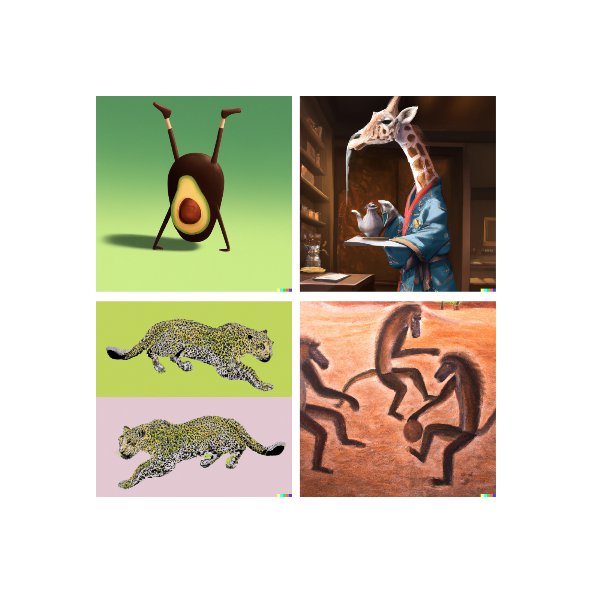

# Machine Learning 101

<div align="center" style="text-align: center; max-width: 640px; margin: 0 auto; margin-top: -83px; margin-bottom: 40px;">
  
  <h3 style="text-align:center;margin-top:-103px;">Images generated with DALL•E.</h3>
</div>

- Machine Learning course content and notebooks built upon the chapters of [Hands-on Machine Learning with Scikit-Learn, Keras &TensorFlow](https://www.oreilly.com/library/view/hands-on-machine-learning/9781492032632/) / 2nd edition.
- Each chapter has its own branch to make the course progression clear.
- This course is offered at [Cologne University of Applied Sciences](https://www.th-koeln.de/studium/technische-informatik-master_1197.php) by Prof. Dr. Beate Rhein in Spring Semester 2023.

## Get Started
Pull repository and go to the root directory:
```shell
$ git clone
$ cd machine-learning-101
```

Create an Anaconda environment and install dependencies:
```shell
$ conda env create -f environment.yml
$ conda activate machine-learning-101
$ python -m ipykernel install --user --name=python3

# start Jupyter kernel:
$ jupyter-notebook
```

## Project: Genre Classification
- As a part of this course, we have developed machine learning models classification of music genres.
- Project content can be found under `./dev/genre-classification`