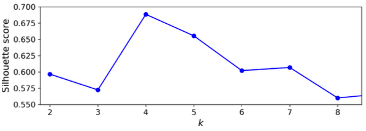

# 07 - Unsupervised Learning 
1. Major benefit of unsupervised learning?
	- It helps use to work on problems with unlabeled data / no test dataset.

2. Describe _clustering_, _anomaly detection_, _density estimation_ in one sentence:
	- Clustering algorithm tackles problems by grouping instances with similarities, where as anomaly detection benefits from this technique by detecting outliers, density estimation is a technique used for understanding data distributions, exploring patterns and detecting outliers.

3. In which applications is clustering used?
	- Recommendation systems
	- Medicine
	- Survelliance Applications

4. How K-Means can be used for dimensionality reduction?
	- After fitting model, centroids can be used to represent the data. Number of centroids (dimensions) are based on the value of **k**. This can work if data groups are clustered in a compact way. But if they are scattered around this may not capture essential information accurately. If we had labels and preserving class information was important other techniques like PCA can be favored.

5. Hard vs. Soft Clustering
   - Hard clustering is method to group the data items such that each item is only assigned to one cluster, K-Means is one of them.
   - Soft clustering is method to group the data items such that an item can exist in multiple clusters, Fuzzy C-Means (FCM) is an example. Soft clustering provides predictions about which class an instance might be belong to.

6. Describe K-Means Algorithm
   - Select centroids from available instances
   - It ends when the clusters doesn't change or we can also define a max iteration value for the algo.

7. Consequences of bad centroid initializing?
	- Too many iterations to finalize or poor results.

8. How to initialize centroids better?
	- We can assign random data points as centroids.
	- Choose centroids with a wide distamce from each other.

9. What is the idea behind KMeans++?
	- K-Means++ is an improvement over the standard K-Means algorithm that aims to initialize the cluster centroids in a way that leads to better convergence and more accurate clustering results. It addresses the issue of centroid initialization by selecting initial cluster centroids that are well-spaced and representative of the underlying data distribution.
	- The K-Means++ initialization helps overcome the issue of initializing centroids close to each other or in regions with low data density. By selecting centroids that are well-distributed across the dataset, K-Means++ improves the chances of converging to better local optima and can yield more accurate clustering results compared to the standard K-Means algorithm.
	- **Step 1:** Select the first centroid randomly: Choose one data point randomly from the dataset as the initial centroid.
	- **Step 2:** Compute distances: For each data point that has not been selected as a centroid, calculate the squared Euclidean distance to the nearest centroid.
	- **Step 3:** Select the next centroid: The next centroid is selected from the remaining data points using a weighted probability distribution. The probability of selecting a data point as the next centroid is directly proportional to its squared distance from the nearest centroid. This ensures that points that are farther away from the existing centroids have a higher probability of being chosen.
	- **Step 4:** Repeat: Repeat steps 2 and 3 until all K centroids have been selected.

10. How did accelerated K-Means and mini-batch K-Means improve training time?
	- Accelarated K-Means helps to accelarate training process by preventing the distance calculation between datapoints and centroids when it is guaranteed to be larger than the best distance (triangle inequality). Or by doing dimensionality reduction prior to the algorithm run and projecting data to a lower-dimensional space.
	- Mini-batch K-Means: A subset of datapoints is used for placement of centroids. This again is beneficial when working with large datasets or near real-time tasks.

11. Measuring performance of K-Means
	- `inertia` is the mean squared distance between each instance and its closest centroid. Smaller the inertia better it is. Then it indicates that clusters are compacted and the instances are not scattered around. Though, it does not provide a direct indication of the best number of clusters.

12. Why is minimizing inertia a bad metric if we try to get the best number of clusters?
	- Inertia decreases as the number of clusters increases
	- Bias towards complex solutions -> artificially complex and less interpretable solutions
	- Lack of external validation -> it is an internal evaluation metric. It doesn't include any domain specific knowledge or signification information into the true underlying structure of the data.

13. How can we find a good guess for k?
	- Elbow method
	- Silhoutte score

14. Explain silhoutte score
	- It measures how well each data point fits within its assigned cluster compared to neighboring clusters.
	- **Step 1:** Compute avg. intracluster distance
	- **Step 2:** Compute avg. nearest neighbor distance
	- **Step 3:** Calculate silhoutte score for each data point = (b -a) / max(a, b)
	- **Step 4:** Calculate overall sillhoutte score by taking avg.
	- Silhoutte score lies in range of [-1, 1]. 1 is good, -1 bad placement of centroids.

15. How to interpret the silhoutte diagramm on page 248?

4 centroids perform the best among the others.

16. What are the limitations of K-Means?
	- Need to specify the number of clusters.
	- It does not behave well for different densities of the clusters or nonspherical shapes.

17. What is the idea behind clustering for image segmentation?
	- The idea behind clustering for image segmentation is to group similar pixels together based on their color, intensity, texture, or other features.
	- By clustering pixels into distinct groups, we can identify different regions or objects within an image, effectively segmenting it.

18. How can clustering be used for semi-supervised learning?
	- The labels of the instances in each cluster can be propagated from the labeled instances within the same cluster. This assumes that instances in the same cluster are likely to belong to the same class, allowing the assignment of labels to the unlabeled data.

19. What is the idea behind label propagation?
	- Label propagation can be particularly useful when there is a small amount of labeled data and a larger amount of unlabeled data.

20. What does active learning mean?
	- A human expert interacts with the learning algorithm, providing labels when the algorithm needs them. There are many different strategies for active learning, but one of the most common ones is called uncertainty sampling.
	- Human expert input is collected when model is uncertain about the prediction.
	- This process continoues until no significant improvent is shown by the model.

21. Which instancs are involved in clusters using the DBSCAN?
	- The instances which form a high density, hence they should be lying close together.

22. What is a core instance in DBSCAN?
	- A core instance has at least **min points** samples in its neighborhood.

23. With which parameters the density in DBSCAN is defined?
	- Epsilon: The radius of the data point
	- Min Points: Number of minimum neighbors that are required to be in the epsilon range.

23. What are the advantages and disadvantages of DBSCAN?
	- + Simple algorithm
	- + Clusters of any shape can be recognized
	- + Robust to outliers
	- - No centroids
	- - Computational complexity O(m^2)
	- - Cannot find clusters of different density

## Addendum
K-means -> Distance-based cluster analysis
	- can't perform well with rounded data tracks
DBSCAN -> Density-based cluster analysis
	- clusters of any shape can be recognized
	- has no centroid
	- computational complexity
	- it can be harder to cluster **if density varies significantly** across the clusters
	- no specification of cluster centers
	- it gets complicated for high-dimensional problems
