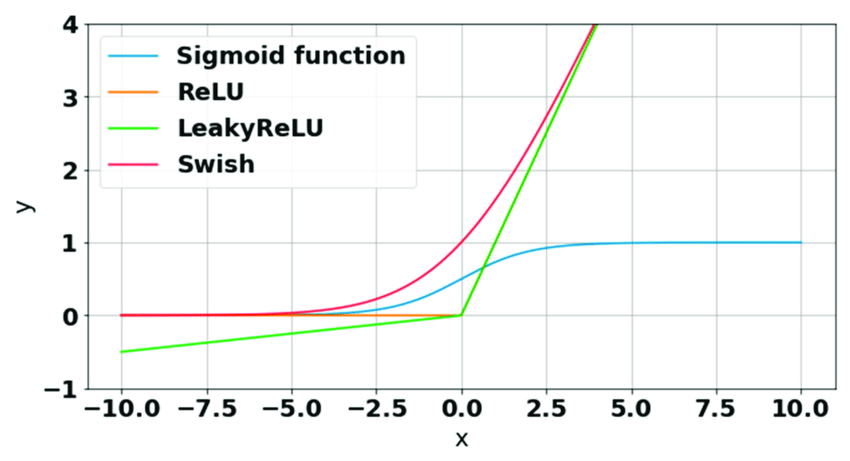

# 10. Deep Neural Networks

1. What are general problems of deep neural networks?

   - Required time & computational power
   - Overfitting
   - Dying ReLU
   - Vanishing / Exploding gradients
   - Model showing no more improvements

2. Describe vanishing gradient problem.

   - When we perform backpropagation, gradient calculation loses its effectiveness as it moves towards to early layers. And these layers parameters are not getting updated hence the gradient vanishes.

3. Why sigmoid function as activation function cause a vanishing gradient?

   - Sigmoid function is identified as a saturated activation function, meaning that as the input value reaches to 0 or 1 the derivate is close to 0 and gradient calculations in this region don't really change the model's parameters.

4. Is it useful to randomly initialize the weights of a NN? What methods do exist?

   - Randomly initializing is a good starting point. Besides, there are other methods tackling vanishing gradients through weight initialization.
   - **Glorot:** Designed for activation function that have apprx. linear activations (sigmoid, tanh).
     - The weights are randomly initialized from a uniform distribution within the range of [-lim, lim] where $lim = \sqrt{(6 / (fanIn + fanOut))}$.
     - _fan_in_, _fan_out_ represents the number of input / output units.
     - This init method aims to **keep variance of activations & gradient relatively constant across layers**.
   - **He:** Designed for ReLU and varients.
     - Weights are initialized randomly from a normal distribution with a mean of 0 and standard devition of $\sqrt{(2 / fanIn)}$.
     - It helps to maintain the variance of activation and gradients across ReLU-based layers.

5. Which initialization method Keras uses by default?

   - ReLU

6. Describe problem of dying ReLU?

   - When ReLU input value is < 0 it's not derivable. This can cause some neurons to shutdown during training.

7. Which activation functions outperform ReLU?

   - Leaky ReLU
   - Parametric Leaky RelU
   - ELU (Exponential Linear Unit)
   - SELU (Scaled Exponential Linear Unit)

8. How does SELU work? What are the advantages and disadvantages?

   - It is a self-normalizing activation function.
   - Automatically adjusts the mean and standard deviation of the outputs within a neural network, promoting stable training and avoiding the vanishing/exploding gradient problem.
   - $SELU = scale * (alpha * x^2 - alpha)$
   - Initialize the weights using the SELU-specific initialization method, which ensures that the outputs have a mean close to zero and a standard deviation close to one.
   - Process the input through the SELU activation function.
   - During forward propagation, the mean and standard deviation of the output are maintained close to zero and one, respectively, due to the self-normalizing property.
   - During backpropagation, the gradients are automatically scaled to avoid vanishing or exploding gradients, ensuring stable and efficient learning.
   - **Advantages**
     - Robustness
     - Self-normalization
   - **Disadvantages**
     - No good match when working with recurrent NNs.
     - It generates nonzero mean output and can be undesirable when we are aiming for zero-centered means.

9. Draw Swish activation function
   

10. Final recommendation for initial activation function?

    - RELU

11. How does batch normalization works?

    - **Mini-batch Computation:** Data is divided into mini-batches.
    - **Normalization:** Calculate the mean & standard deviation across the minibatch for each feature.
    - **Normalization Step:** Normalize activations. This is done by substracting mean and dividing by standard deviation for each feature.
    - **Scaling & Shifting:** Normalized activations are multiplied by a learnable scaling parameter (γ) and added to a learnable shifting parameter (β). These parameters allow the network to learn optimal scale and shift for normalized activations.
    - **Backpropagation:** The gradients with respect to the parameters (γ and β) as well as the normalized activations are computed and parameters are updated.
    - **Inference:** Learned parameters are used to normalize activations of each test example. No need to compute mini-batch statistics during inference.

12. Batch normalization advantages / disadvantages?

    - **Advantages**
      - Stability
      - Faster convergence
      - Regularization
    - **Disadvantages**
      - Batch size sensitivity
      - Not applicable for every NN architecture (RNNs)
      - Increased training time

13. How does transfer learning work? When it is useful to use it?

    - Transfer learning can be used in case the problem is complex, we have little training data and there already a pretrained model on a similar problem happen to exists. We can basically use this pretrained model, remove the last hiiden layer | output layer and fit the model to the data using freezed layers. This technique is effective when the lower levels are already trained on similar properties and higher levels can quickly adapt to the specific usecase.

14. How to find a good model when we have few labeled data?

    - Unsupervised Pre-Training
    - Auxilary Training

15. Explain self-supervised learning (give an example).

    - In self-supervised learning, the model generates its own labels from the data itself, without requiring explicit human annotations. These learned representations can then be transferred to downstream tasks, improving the model's performance.
    - **Task Definition:**Choose a surrogate task that creates a pretext or proxy label from the data. This pretext task should be designed to capture meaningful information or structure within the data.
    - **Data Preparation:** Gather a large amount of unlabeled data. This data can be unannotated images, text corpora, videos, or any other type of unstructured data.
    - **Pretext Task Creation:** Create a surrogate task that utilizes the unlabeled data to generate labels or targets. This task should be solvable using the inherent patterns or structures present in the data. For example: - **Image Rotation:** Randomly rotate images and train the model to predict the correct rotation angle. - **Context Prediction:** Remove certain words from a sentence or paragraph and train the model to predict the missing words.
      **Model Training:** Train a neural network model to solve the pretext task using the unlabeled data. The model learns to extract useful features or representations from the data while trying to solve the surrogate task.
      **Feature Extraction:** Once the model is trained on the pretext task, use the learned representations as features for downstream tasks. These learned features can be transferred to other tasks, such as image classification, object detection, or sentiment analysis.

16. List regularization techniques to avoid overfitting.

    - Batch-normalization
    - Drop-out
    - L1, L2
    - Early stopping
    - Max-Norm Regularization

17. Describe _L1_ & _L2_ regularizations.

    - They add a regularization term to the loss function during training.
    - The regularization term penalizes the complexity of the model, encouraging it to have smaller weights.
    - **L1 (Lasso)**
      - Adds sum of the absolute values of model's weights to the loss function.
      - L1 regularization encourages sparsity by driving some weights to exactly zero. This makes it useful for feature selection, as it can effectively reduce the number of features considered by the model.
      - $ λ \* ||w||\_1 $ w is model's weights
      - The L1 regularization term is differentiable everywhere except at zero, which poses challenges in gradient-based optimization methods.
      - More robust to outliers compared to L2.
      - It can create models with fewer features, as it encourages sparsity.
    - **L2 (Ridge)**
      - Adds the sum of squared of model's weight (L2 norm / Eucledian norm) to the loss function.
      - $ λ \* \exp{||w||\_2}² $
      - It promotes small weights across all dimensions without driving any weights to exactly zero. It is effective in preventing individual weights from becoming too large and helps to control overfitting.
      - The L2 regularization term is differentiable everywhere.

18. How does drop-out technique work?

    - With a probility of $p$ it drops out neurons of specified layers during each training iteration.
    - During inference, the entire network is used without dropout, but the weights of the neurons are scaled by the dropout rate to compensate for the increased number of active neurons.
    - Best practive is to put a drop-out step to the last hidden layer.

19. Is there any disadvantage of drop-out?
    - Increased training time
    - Loss of information
    - Input dependence -> it assumes that each input neuron are independent, though sometimes this may not be the case (_e.g._ recurrent NNs, CNNs)
